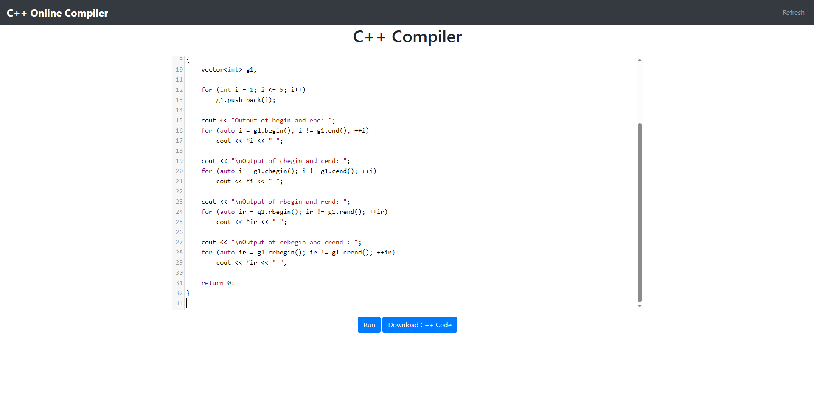
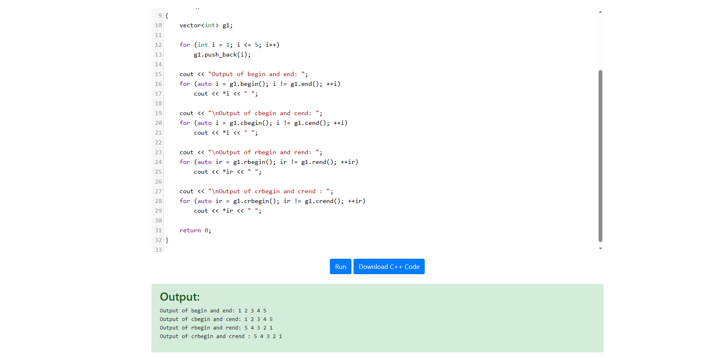

# Project Name
The Online C++ Compiler is a web-based platform that allows users to write, compile, and run C++ code directly from their browser, including a user-friendly interface and powerful code editor. The code will be sent to the server and be compiled in realtime, to prevent duplicate request of the same code, the server embeds a LRU cache to enhance the performance.

## Demo
* Home Page

* Compile

## General Design Flow:
https://docs.google.com/document/d/151UgRyzX1GIQnWgQZXjd5QYPJwO0W-ZCCpm5zK5xot8/edit?usp=sharing

## System Setup
To run this project run the command 'pip install -r requirements.txt'
